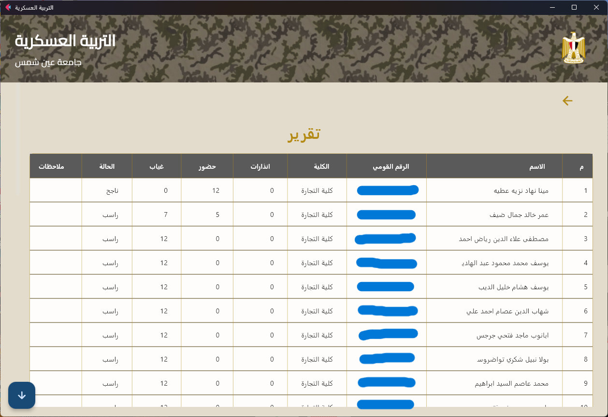

# Attendance Manager (نظام إدارة التربية العسكرية)

Attendance Manager is a user-friendly desktop application designed for tracking student enrollments and attendance in military education courses. Built with Flet, it offers an intuitive bilingual interface (Arabic/English) with full right-to-left (RTL) support, bulk data import, QR code attendance, and comprehensive reporting.

---

## ⭐️ Key Features

- **Easy Student Management:** Add, search, and update student records; assign them to faculties and courses.
- **Course Scheduling:** Organize military or training courses by faculty, date, and gender.
- **Attendance Tracking:** Mark arrival and departure quickly using QR codes.
- **Bulk Import:** Quickly add large numbers of students from PDF files.
- **Comprehensive Reports:** Generate and export attendance reports for students, courses, or faculties.
- **Bilingual and RTL Support:** Full Arabic interface; easy switching between languages.
- **Modern, Responsive Design:** Clean layouts, works on various screen sizes, professional look and feel.

---

## 🚀 Getting Started

### 1. Clone the repository

```bash
git clone https://github.com/your-username/attendance-manager.git
cd attendance-manager
```

### 2. Set up a virtual environment

```bash
python -m venv venv
```
Activate it:

- On Windows:
  ```bash
  venv\Scripts\activate
  ```
- On macOS/Linux:
  ```bash
  source venv/bin/activate
  ```

### 3. Install requirements

```bash
pip install -r requirements.txt
```

### 4. Create a `.env` file

Before running the app, create a file named `.env` in the root directory of the project, and add the following lines:

```
DATABASE_URL=
APP_PASSWORD_HASH=
```

- **DATABASE_URL:** Leave empty to use the default local SQLite database.
- **APP_PASSWORD_HASH:** Leave empty and once inside the app, you can reset the password and a new hash will be generated automatically.

### 5. Run the application

```bash
python main.py
```

You’ll see a modern desktop window ready to use. No additional setup is necessary!

---

## 📸 Screenshots

### Dashboard


### Course Options


### Search for taking photos


### Take Photo


### New Course Register


### Course Management


### Add Student Manually


### Take Attendance


### Report Export Menu


### Search to Manage Students


### Password 


### Edit Student Info


### Mark Attendance Manually 


### Attendance Report Export


### Status Report Export


### Manage Faculties


## 📁 About the Technology

- **Built with Flet:** A Python-based framework inspired by Flutter, for interactive, attractive UIs.
- **Uses SQLite:** No server setup needed—everything stays local and simple.
- **PDF, Excel, and QR Support:** Handle bulk imports, reporting, and fast attendance checking.
- **RTL, Arabic-First:** Proper support for Arabic text, from the interface to the database.
